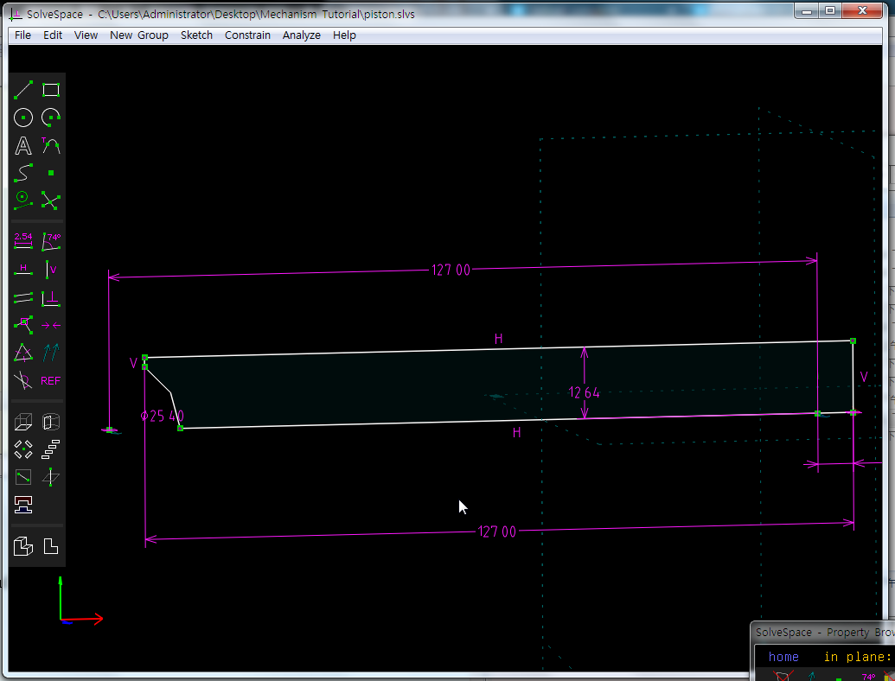

Title: Week 16
Date: 2016-12-30 22:00
Category: Misc
Tags: 使用導引, 創造力, 表達能力, 協同設計
Author: 40423234

solvespace畫圖 Part.three

<!-- PELICAN_END_SUMMARY -->

WOW!這禮拜大進步，一下子畫了一大堆圖，機構也畫了，畫了還真不是普通的久，整個假日光畫這張圖就飽了，一直弄錯以外，還為了旋轉除料倒騰了好久，去YOUTUBE上看影片，結果人家按就有，我按就沒有，弄一大堆，還跑去問同學，搞了一陣子後，懶得解決了，直接在長料的步驟就畫出那個凹槽，原本以為結束了，結果哩!還有一個零件也要搞凹槽，我這次學乖了，長料時就搞好，一次搞定。雖然到最後還是沒用到旋轉除料，但至少知道怎麼按就好。

這裡直接畫好凹槽

旋轉長料~~~~

這個也是，看到有第二個真的氣瘋

YA~:D這次難不倒我了!